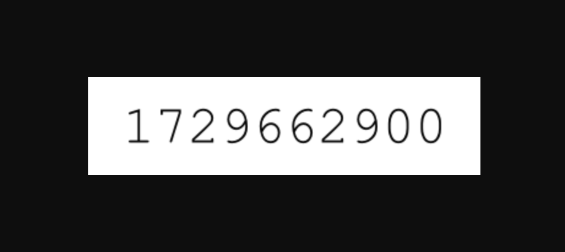

# `epoch_clock`

> lol why did I use rust for this?  
  
  - [`a fool`](https://gh.zod.tf)  
  

  

## Tech Stack
- Rust
- Actix-web
- Image

## Configuration  
Not much to do here but put it in `.cargo/config.toml`.  
See `.cargo/config.example.toml` for the environment variables.  
  
### Environment Variables  
- `APP_ENV`: Set to `development` or `production`.
- `HOST`: The host address to bind the server.
- `PORT`: The port number to bind the server.

## Deployment
Deploys to Heroku.  